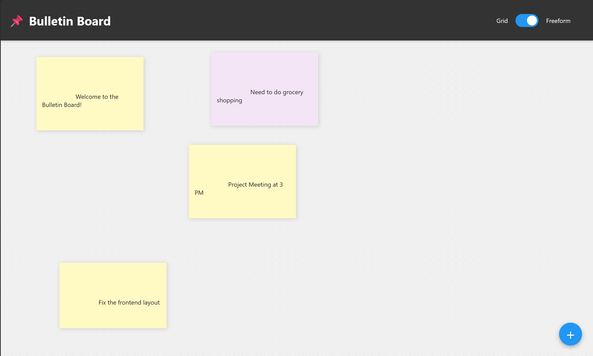

# BulletinView 📌

An interactive, real-time digital bulletin board built with Flask and SQLite. Drag-and-drop or paste notes, images, audio, and web links to organize your ideas visually.

**Live Demo**: [https://bulletin-view.vercel.app/](https://bulletin-view.vercel.app/)

 <!-- Placeholder for screenshot -->

## ✨ Features

- **Toggleable Layouts**: 
  - **Grid View**: Clean, structured organization for quick reading.
  - **Freeform Canvas**: Drag and drop notes anywhere to visually group ideas. Positions are persisted!
- **Interactive UI**: 
  - Floating Action Button (+) for easy note creation.
  - Inline **Edit (✎)** and **Delete (🗑)** controls for every note.
  - **Color Coding**: Choose from 5 different colors to categorize your notes.
- **Multimedia Support**:
  - **Smart Link Previews**: Paste any URL to automatically generate a preview card with image and description.
  - **Drag & Drop / Paste**: Support for images and audio files.
  - **Built-in Players**: Play audio files directly within their notes.
- **Persistence**: Powered by SQLite to keep your notes, colors, and spatial coordinates safe across sessions.

## 🚀 Getting Started

### Prerequisites
- Python 3.8+
- Flask
- linkpreview

### Local Installation
1. Clone the repository:
   ```bash
   git clone https://github.com/yourusername/BulletinView.git
   cd BulletinView
   ```
2. Install dependencies:
   ```bash
   pip install -r requirements.txt
   ```
3. Run the application:
   ```bash
   python BulletinView.py
   ```
4. Open your browser and navigate to `http://localhost:5000`.

## ☁️ Deployment

### Vercel (Serverless)
This project is configured for easy deployment on Vercel.
1. Push code to GitHub.
2. Connect your repo to [Vercel](https://vercel.com).
3. The `vercel.json` will handle the configuration.
*Note: On Vercel, the SQLite database and media uploads are stored in `/tmp` and will reset periodically.*

### Render / Railway (Persistent)
For persistent storage, use a platform that supports persistent disks.
- **Start Command**: `gunicorn BulletinView:app`

## 🛠 Tech Stack
- **Backend**: Python, Flask, SQLite
- **Frontend**: HTML5, CSS3 (Grid/Flexbox), JavaScript, jQuery, jQuery UI
- **Libraries**: linkpreview (for Open Graph data)

## 📄 License
MIT
